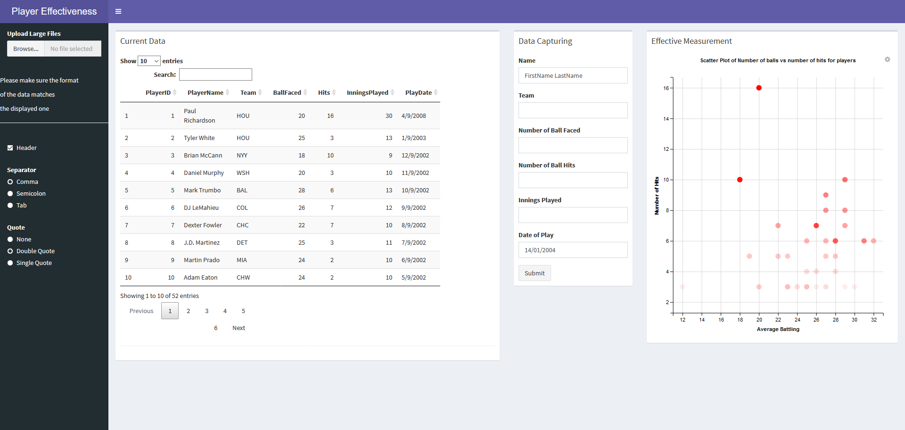

```{r setup, include=FALSE}
knitr::opts_chunk$set(echo = TRUE)
```


This is a shiny application to demonstrate creating, reading, updating, and deleting of records. 


## To-Do

* Add option to delete a player from database
* error handling
* expand database

## Screenshot of Application



## To run the app on RStudio use the command below

`runGitHub("fkotey/R_Projects/", subdir = "bball/")`